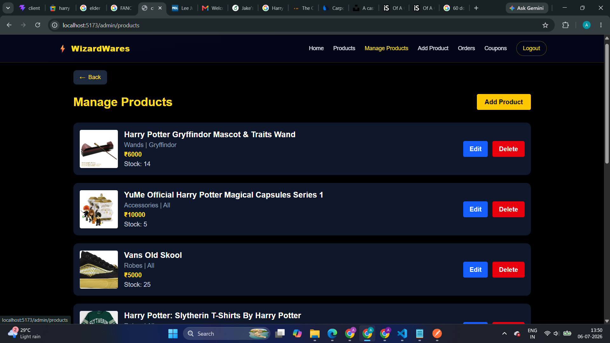
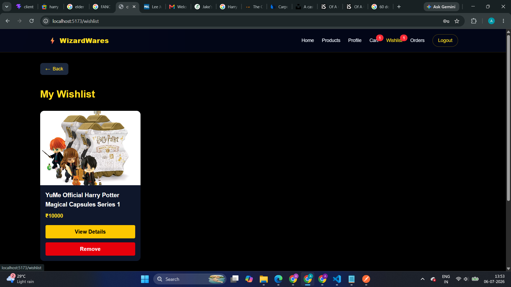
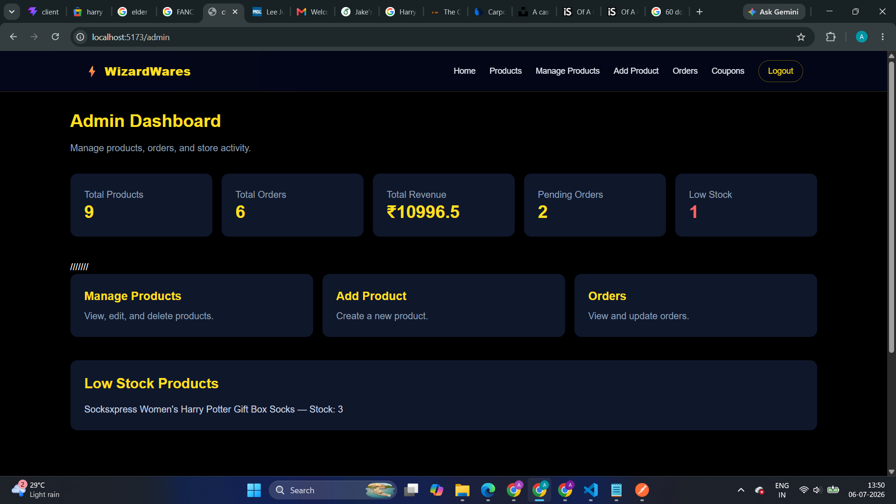
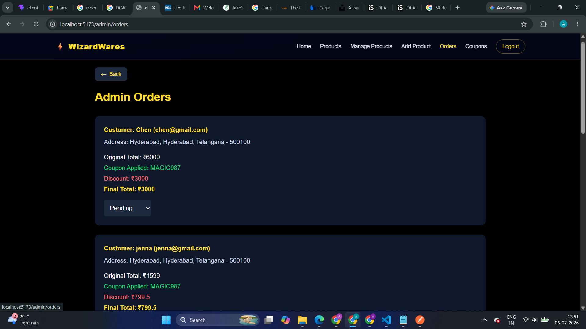

# ⚡ WizardWares - Harry Potter MERN E-Commerce Store

WizardWares is a full-stack MERN e-commerce application inspired by the Harry Potter universe. It provides a seamless shopping experience for users while offering a complete admin dashboard to manage products, orders, and coupons.

## 🌐 Live Demo

**Frontend:** https://harry-potter-store.vercel.app

**Backend API:** https://harry-potter-store.onrender.com

---

## ✨ Features

### 👤 User Features

- User Authentication (Register/Login)
- JWT Authentication
- Browse Products
- Search Products
- Search Suggestions
- Category Filtering
- House Filtering
- Product Sorting
- Pagination
- Product Details
- Add to Cart
- Quantity Management
- Wishlist
- Recently Viewed Products
- Recommended Products
- Coupon Support
- Checkout
- Order History
- Order Details
- Cancel Pending Orders
- Product Reviews & Ratings
- User Profile
- Responsive Design
- Skeleton Loading
- Toast Notifications

---

### 👨‍💼 Admin Features

- Secure Admin Login
- Admin Dashboard
- Manage Products
- Add Products
- Edit Products
- Delete Products
- Manage Orders
- Update Order Status
- Manage Coupons
- Create Coupons
- Delete Coupons
- Low Stock Monitoring
- Revenue Dashboard

---

## 🛠 Tech Stack

### Frontend

- React.js
- TypeScript
- React Router DOM
- Tailwind CSS
- Axios
- React Hot Toast
- Vite

### Backend

- Node.js
- Express.js
- MongoDB
- Mongoose
- JWT Authentication
- bcrypt.js

### Deployment

- Frontend: Vercel
- Backend: Render
- Database: MongoDB Atlas

---

## 📸 Screens

- Home Page
- Product Listing
- Product Details
- Cart
- Wishlist
- Checkout
- Orders
- Profile
- Admin Dashboard
- Product Management
- Order Management
- Coupon Management

---

## 📂 Project Structure

```
harry-potter-store/
│
├── client/
│   ├── src/
│   ├── public/
│   └── package.json
│
├── server/
│   ├── controllers/
│   ├── middleware/
│   ├── models/
│   ├── routes/
│   └── server.js
│
└── README.md
```

---

## 📸 Screenshots

### Home Page


---

### Products


---

### Product Details



---

### Cart


---

### Wishlist



---

### Orders


---

### Profile


---

### Admin Dashboard


---

### Add Products


---
### Admin Dashboard



---

### Admin Orders



---

### Coupons


## ⚙️ Installation

### Clone Repository

```bash
git clone https://github.com/Apoorva-Bairi/harry-potter-store.git
```

Move into project

```bash
cd harry-potter-store
```

---

### Backend

```bash
cd server
npm install
npm run dev
```

Create a `.env`

```env
PORT=8000
MONGO_URI=YOUR_MONGODB_URI
JWT_SECRET=YOUR_SECRET_KEY
CLIENT_URL=http://localhost:5173
```

---

### Frontend

```bash
cd client
npm install
npm run dev
```

Create a `.env`

```env
VITE_API_URL=http://localhost:8000/api
```

---

## 🚀 Deployment

Frontend

- Vercel

Backend

- Render

Database

- MongoDB Atlas

---

## 📌 Future Improvements

- Razorpay/Stripe Payment Gateway
- Email Notifications
- Product Image Upload (Cloudinary)
- Inventory Analytics
- Order Tracking Timeline
- Product Favorites
- Dark/Light Theme
- Sales Reports
- Admin Charts

---

## 👨‍💻 Author

**Apoorva Bairi**

GitHub:
https://github.com/Apoorva-Bairi


---

## 📄 License

